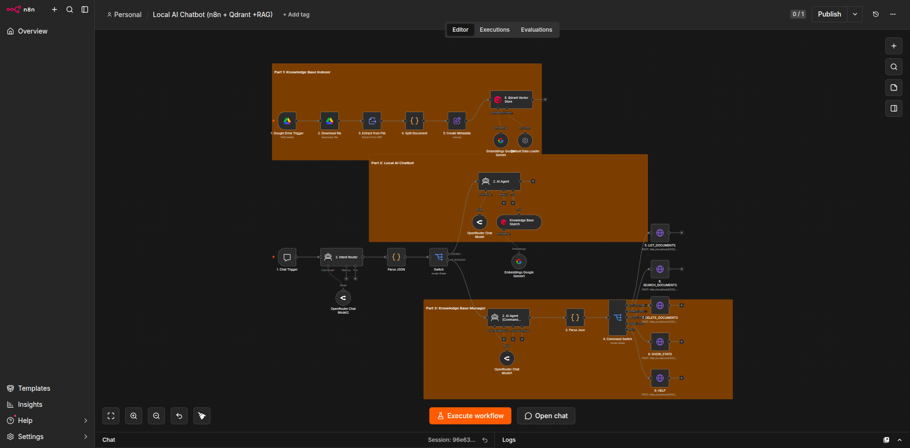

# 🤖 Local AI Chatbot (RAG)


A **Retrieval-Augmented Generation (RAG)** chatbot built with **n8n**, **Qdrant**, **OpenRouter**, and **Docker**. The workflow indexes custom documents into a vector database and retrieves relevant knowledge to generate accurate, context-aware AI responses.

---

# 📖 Overview

## Problem

Large Language Models have limited knowledge of private or company-specific information. They can generate inaccurate responses when asked about documents they have never seen.

## Solution

This project implements a complete **Retrieval-Augmented Generation (RAG)** pipeline that transforms uploaded documents into a searchable knowledge base. Instead of relying solely on an LLM's internal knowledge, the chatbot retrieves relevant document chunks from Qdrant and uses them as context before generating a response.

The result is a private AI assistant capable of answering questions using your own documents.

---

# ✨ Features

## 📄 Knowledge Base Indexing

- Detect uploaded documents automatically
- Extract document text
- Split content into semantic chunks
- Generate vector embeddings
- Store vectors in Qdrant
- Build a searchable knowledge base

## 🤖 AI Chatbot

- Natural language conversations
- Semantic document search
- Context-aware AI responses
- Retrieval-Augmented Generation (RAG)
- AI Agent orchestration
- Relevant document retrieval

## ⚙️ Knowledge Management

- Modular workflow architecture
- Scalable vector storage
- Local deployment with Docker
- Easy integration with additional data sources

---

# 🏗 Workflow Architecture

```
                 Upload Documents
                        │
                        ▼
          Knowledge Base Indexer
                        │
                        ▼
              Extract Document Text
                        │
                        ▼
              Generate Embeddings
                        │
                        ▼
             Store Vectors (Qdrant)
                        │
                        ▼
                User Question
                        │
                        ▼
                  AI Agent (n8n)
                        │
                        ▼
             Vector Similarity Search
                        │
                        ▼
            Retrieve Relevant Chunks
                        │
                        ▼
             Generate AI Response
```

---

# 📸 Workflow Screenshot

The image below shows the complete **Local AI Chatbot (RAG)** workflow implemented in **n8n**, including document indexing, vector storage in Qdrant, and AI-powered question answering.

<p align="center">
  
</p>

---

# 🛠 Tech Stack

## Workflow Automation

- n8n

## AI

- OpenRouter
- Retrieval-Augmented Generation (RAG)
- Embedding Models

## Vector Database

- Qdrant

## Infrastructure

- Docker
- Ollama (Optional Local LLM)

## Programming

- JavaScript

---

# 📂 Repository Structure

```
Local-AI-Chatbot-n8n-Qdrant-RAG/

├── README.md
├── workflow/
│   ├── Knowledge Base Indexer.json
│   ├── Local AI Chatbot.json
│   └── Knowledge Base Manager.json
| <!-- 🚧 Knowledge Base Manager.json is currently under development. Additional features, improvements, and future updates will be added in upcoming releases. -->
├── screenshots/
│   └── workflow.png
└── LICENSE
```

---

# ⚙️ Setup Guide

## 1. Clone Repository

```bash
git clone https://github.com/belioautomation/Local-AI-Chatbot-n8n-Qdrant-RAG.git
```

## 2. Import Workflows

Import each workflow into your n8n instance.

- Knowledge Base Indexer
- Local AI Chatbot
- Knowledge Base Manager

## 3. Configure Credentials

Configure the required credentials:

- OpenRouter API
- Qdrant
- Google Drive (optional)
- Telegram (optional)

## 4. Configure Vector Database

Create a Qdrant collection.

Configure:

- Embedding Model
- Collection Name
- Similarity Metric

## 5. Activate Workflows

Run the Knowledge Base Indexer before using the chatbot.

---

# 📊 RAG Pipeline

```
Upload Documents
        │
        ▼
Extract Text
        │
        ▼
Chunk Documents
        │
        ▼
Generate Embeddings
        │
        ▼
Store in Qdrant
        │
        ▼
User Question
        │
        ▼
Retrieve Context
        │
        ▼
Generate AI Response
```

---

# 💡 Skills Demonstrated

- Retrieval-Augmented Generation (RAG)
- AI Workflow Automation
- Vector Database Integration
- Semantic Search
- Prompt Engineering
- AI Agent Development
- n8n Workflow Design
- Docker Deployment
- Document Processing
- Enterprise Knowledge Management

---

# 🎯 Use Cases

- Company Knowledge Base
- Internal Documentation Assistant
- Research Assistant
- Customer Support Knowledge Bot
- Study Assistant
- Technical Documentation Search
- Policy & SOP Assistant

---

# 🔮 Future Improvements

- User Authentication
- Conversation Memory
- Web Chat Interface
- Multi-user Support
- Metadata Filtering
- Hybrid Search
- Citation Support
- Multiple LLM Support

---

# 👨‍💻 Author

**Belio C. Sinangote**

BS Information Technology Student  
AI Automation Developer | n8n Workflow Builder

GitHub:
https://github.com/belioautomation

---

# 📄 License

This project is licensed under the MIT License.
